<br />
<p align="center">
    <a href="https://gitlab.cern.ch/tswirski/mezzanine-tester">
        
    </a>
    <h3 align="center">Mezzanine Mass Test Software</h3>
<p align="center">
    Mezzanine Tester Tool Software to use with the tester tool hardware to test the new mezzanine cards for the Phase II ATLAS MDT Upgrade Project, containing both the testing software as well as a database tool for visualization of the saved data. Maintained by the University of Würzburg ATLAS group.
    <br />
    <a href="https://gitlab.cern.ch/tswirski/mezzanine-tester"><strong>Explore the docs »</strong></a>
    <br />
    <a href="https://gitlab.cern.ch/tswirski/mezzanine-tester/issues">Report Bug</a>
    ·
    <a href="https://gitlab.cern.ch/tswirski/mezzanine-tester/issues">Request Feature</a>
  </p>
</p>

# Table of Contents
* [Introduction](#introduction)
* [Installation](#installation)
    * [Requirements](#requirements)
    * [Windows 10](#windows-10)
    * [Ubuntu](#ubuntu)
    * [Compilation using PyInstaller](#compilation-using-pyinstaller)
* [Program Overview](#program-overview)
    * [The Tester Tool Software](#the-tester-tool-software)
        * [The Main Screen](#the-main-screen)
        * [Configuration](#configuration)
        * [Mezzanine Configuration](#mezzanine-configuration)
        * [Test Setup](#test-setup)
        * [Result Screens](#result-screens)
            * [Test Overview](#test-overview)
            * [VDD-Sweep Result](#vdd-test-result)
            * [JTAG-Test Result](#jtag-test-result)
            * [Bunch-Test Result](#bunch-test-result)
            * [Mode-Test Result](#mode-test-result)
            * [S-Curve Result](#s-curve-result)
            * [Noise-Test Result](#noise-test-result)
            * [Cross Talk Result](#cross-talk-result)
            * [Reverse Cross Talk Result](#reverse-cross-talk-result)
            * [Charge Monotony Test Result](#charge-monotony-test-result)
            * [Delay-Test Result](#delay-test-result)
    * [The Database Tool](#the-database-tool)
        * [List of Tests](#list-of-tests)
        * [Test View](#test-view)
* [Using the Program](#using-the-program)
# Introduction

This project aims to facilitate the use of the Mezzanine Tester Tool for the Phase-II upgrade of the ATLAS MDT system. Several thousand mezzanine cards of a new type are being produced and have to be tested individually to make sure all detectors will work flawlessly during the rest of the detector lifetime. With this tool, all defined tests can be performed automatically, the user just has to enter the mezzanine's ID and start the measurement. All results are automatically entered into a local database, which can then be synchronized with a central database, if desired. This project also contains a program that allows experts to reload the test results and evaluate them, including an option to dump all created plots a pictures.

# Installation

This chapter will explain how to install the Mezzanine Mass Test Software on your PC. Please check the requirements in the next section. A step-by-step installation guide is also provided.

## Requirements
This Package uses Python 3.9.6 with Kivy 2.0.0, with some additional packages for serial communication and math functionality.
Kivy requires a PC that is able to run OpenGL ES version 2.0 or higher. If you are following the step-by-step guide, you don't have to install the requirements right now. The guide will tell you when to do this.

All Packages needed can be found in the requirements.txt file and are also listed here:

* Kivy==2.0.0
* matplotlib==3.4.2
* numpy==1.21.0
* pyserial==3.5
* scipy==1.7.0


## Windows 10
This step-by-step guide includes installation instructions for git and python, which can be skipped if they are already installed. If that is the case, you can start from [section 3](#3-downloading-the-project).

### 1. Installing Python

For Windows 10, the first step includes installing a version of python. This tool uses version 3.9.6, which can be found <a href="https://www.python.org/ftp/python/3.9.6/python-3.9.6-amd64.exe">here</a>. Feel free to install the most recent version of python 3, which can be found <a href="https://www.python.org/downloads/windows/">here</a>, but it might introduce bugs in rare circumstances.

Once you are done with the installer, python is ready for use, and you can continue by installing git.

### 2. Installing git

You can just download this repository as a zip from the gitlab page you are most likely visiting right now. If you don't need any fancy versioning or want to regularly update this software, you will not have to install git on your PC and you can skip this section and directly go to [section 3.2](#32-downloading-the-zip).

If you want to install git, first download it from <a href="https://gitforwindows.org/">here</a>.

Follow the instructions of the installer. You can choose a graphical version, or a bash version (or both). Once the installer has done its work, you can use both the gui and bash versions from the start menu or by right-clicking into a folder.

### 3. Downloading the Project
You have two options to download the project: Using git ([section 3.1](#31-using-git)), or downloading the .zip directly ([section 3.2](#32-downloading-the-zip)). If you don't need the git functionalities (like versioning or easy updating) you can just download the zip file.

#### 3.1 Using git

If you have not set up the cern gitlab ssh authentication, visit <a href="https://gitlab.cern.ch/help/ssh/index"> this </a> page and follow the instructions to be able to download the repository.

Depending on whether you want to use the GUI or the bash version of git, the download works slightly differently. You only need to do one and once the repository is set up, you can even switch in-between the two options, so choose whichever you feel more comfortable with right now.

#### 3.1.1 Using the GUI

Start the GUI (for example by entering git GUI in the Windows search bar) and click "Clone Existing Repository". On the next screen, it will ask you to enter a source, which is the gitlab repository. If you are reading this on the gitlab page right now, scroll up and click the "clone" button on the right hand side above the contents list and copy the ssh link. Paste it into the source field and select a folder on your PC for the target (this folder will be called "project folder" from now on). Then hit clone. Enter your passphrase for the ssh key (you might have to enter it multiple times) and the repository will be downloaded.

After it is done, you can continue by installing the [requirements](#4-installing-the-requirements).

#### 3.1.2 Using the bash

Start the git CMD (for example by entering git CMD in the Windows search bar) and navigate to the location you want to install the repository to. Run the following command:

```cmd
git clone ssh://git@gitlab.cern.ch:7999/tswirski/mezzanine-tester.git
```

Enter your passphrase for the ssh key you created and it will download the repository into a new folder called mezzanine-tester (which will be called "project folder" from now on). Once it is done, you are ready to continue by installing the [requirements](#4-installing-the-requirements).

#### 3.2 Downloading the .zip

Just click the download button on the top right of the content list of the repository above this readme and choose zip. Once it is downloaded, open the zip file and unpack into a folder of your choice (from now, the top folder of the project, mezzanine-tester-master will be called the "project folder"). You can rename the mezzanine-tester-master folder to anything you like. With the repository data on your PC, you can now continue to install the requirements in your python version.

### 4. Installing the Requirements

Before you install the requirements, you should create a virtual environment. This creates a special environment that is isolated from your base installation (and all other installations), meaning you will not get problems if you need different versions of the same packages in a different project. If you don't want to use a virtualenv, you can skip this step and go directly to [section 4.2](#42-installing-the-packages).

#### 4.1 Creating and switching to the virtual environment

You can create a virtual environment (venv) by opening your regular shell (either CMD or PowerShell), navigating to the project folder and entering:

```cmd
py -m venv testertoolenv
```
This will create a folder containing a venv with the name testertoolenv. You can switch to it from the project folder by entering:

```cmd
testertoolenv\Scripts\activate
```
Your shell will now say (testertoolenv) in front of your current path. If you open a new shell, you will have to activate the virtualenv again (make sure you are in the project folder). Always check if it says (testertoolenv) if you use this project, else it might not work correctly.
Now you are ready to install the packages in the virtualenv.

N.B.: The name testertoolenv used here is already ignored by git. If you use a different name, make sure to add it to the .gitignore file, too, so it is not seen by git.

#### 4.2 Installing the Packages

Open your regular shell (either CMD or PowerShell) and navigate into your local repository folder. Activate your venv, if you set it up, then enter:

```cmd
pip install -r requirements.txt
```

This will automatically install all requirements for the package and you are ready to go!

### 5 Starting the Programs

Now that everything is installed, you can simply start the tester tool software by executing the following command in your CMD or Powershell (don't forget the venv if you made one!):

```cmd
py -m main_tester
```

If you want to run the database tool, just enter:

```cmd
py -m main_DBtool
```

This is everything you need to get started. The programs will be explained in the next [chapter](#usage).

## Ubuntu
In Ubuntu, python 3 is already installed. If you want to use git, you can refer to the next section. Else you can skip over and go directly to [section 2](#2-getting-the-code).

### 1 Installing git

You can install git using the the default Ubuntu package manager by executing:

```sh
sudo apt-get install git
```
You need to be able to install software to do this (be a sudoer). If you are not, ask your system admin to install it for you. It might be installed already, so try the following command to verify the installation:

```sh
git --version
```

Once git is installed, you can get continue by getting the code, see [section 2.1](#21-using-git).

### 2 Getting the Code

You have two different options to get the code. First, you can use git to get versioning and easy updating, or you can just download it from the repository directly.

#### 2.1 Using git

If you have not set up the cern gitlab ssh authentication, visit <a href="https://gitlab.cern.ch/help/ssh/index"> this </a> page and follow the instructions to be able to download the repository.

Then, use the shell to navigate to the location you want the repository to be in and do:

```sh
git clone ssh://git@gitlab.cern.ch:7999/tswirski/mezzanine-tester.git
```

Enter the passphrase for your ssh key and it will download the repository to your PC. You are now ready to install the [requirements](#3-installing-the-requirements).

#### 2.2 Downloading the tar

Just click the download button on the top right of the content list of the repository above this readme and choose tar.gz. Once it is downloaded, unpack it into a folder of your choice (from now, the top folder of the project, mezzanine-tester-master will be called the "project folder"). To unpack, you can use the following command:

```sh
tar -xzvf mezzanine-tester-master.tar.gz .
```

You can rename the mezzanine-tester-master folder to anything you like. With the repository data on your PC, you can now continue to install the [requirements](#3-installing-the-requirements) in your python version.

### 3 Installing the Requirements

Before you install the requirements, you should create a virtual environment. This creates a special environment that is isolated from your base installation (and all other installations), meaning you will not get problems if you need different versions of the same packages in a different project. If you don't want to use a virtualenv, you can skip this step and go directly to [section 3.2](#32-installing-the-packages).

#### 3.1 Creating and switching to the virtual environment

In some distributions, the python3-venv package has to be installed using the usual package manager. For Ubuntu, this can be done using the following command:

```sh
sudo apt-get install python3-venv
```

If you are not a sudoer, please ask your system admin to install the package for you (if it is not already installed).

You can create a virtual environment (venv) by opening your regular shell, navigating to the project folder and entering:

```sh
python3 -m venv testertoolenv
```

This will create a folder containing a venv with the name testertoolenv. You can switch to it from the project folder by entering:

```sh
source testertoolenv/Scripts/activate
```

Your shell will now say (testertoolenv) in front of your current path. If you open a new shell, you will have to activate the virtualenv again (make sure you are in the project folder). Always check if it says (testertoolenv) if you use this project, else it might not work correctly.
Now you are ready to install the packages in the virtualenv.

N.B.: The name testertoolenv used here is already ignored by git. If you use a different name, make sure to add it to the .gitignore file, too, so it is not seen by git.

#### 3.2 Installing the Packages

Open your regular shell and navigate into your local repository folder. Activate your venv, if you set it up, then enter:

```sh
python3 -m pip install -r requirements.txt
```

This will automatically install all requirements for the package and you are ready to go!

### 4 Starting the Programs

Now that everything is installed, you can simply start the tester tool software by executing the following command in your bash (don't forget the venv, if you made one!):

```sh
python3 -m main_tester
```

If you want to run the database tool, just enter:

```sh
python3 -m main_DBtool
```

This is everything you need to get started. The programs will be explained in the next [chapter](#usage).

## Compilation Using PyInstaller (Windows only)

If you installed python and the requirements on your PC, you don't have to compile the program. If you want to distribute the software to several Windows PCs that don't have python installed, you can compile the software using pyinstaller from your Windows PC. First, you have to install pyinstaller. This can be done with pip. In your shell (CMD or PowerShell), using your virtualenv if you set it up, enter:

```cmd
pip install pyinstaller
```

Then you can execute the file pyinstaller_win64.bat in the project folder either by clicking on it, or by using the command (in CMD or PowerShell from your project folder):

```cmd
pyinstaller_win64.bat
```

This will take a while and automatically compile both the tester and the database tool. The executables can then be found in the dist folder in the project directory.

# Program Overview

 This chapter is dedicated to the introduction to the usage of both the tester tool software and the database tool, starting with the tester tool software and finishing with the database tool.

## The Tester Tool Software

This section will introduce the basic functions of the tester tool software. First, it will go over the main screen you see when you open the program. Then, it will introduce the different options that can be set in the tool itself. In a last part, it will introduce the result screens.

### The Main Screen

The program opens on the main screen. From here, all settings can be accessed and tests can be run. The Tester screen can be seen here:

<p align="center">
    <a href="https://gitlab.cern.ch/tswirski/mezzanine-tester">
        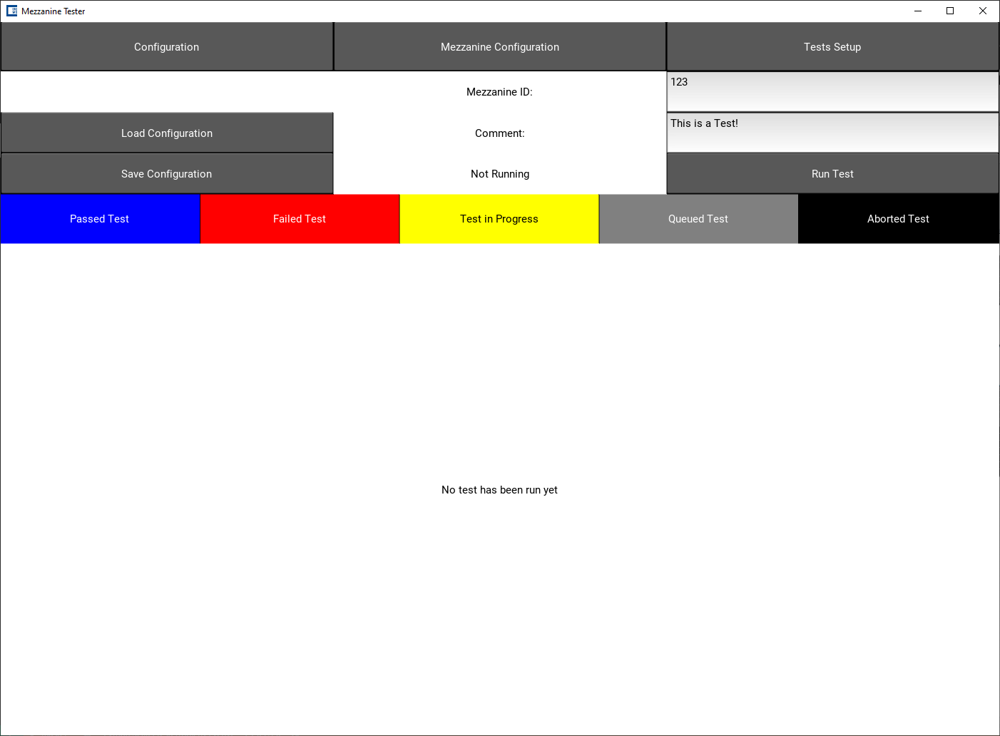
    </a>
<p align="center">

The top row contains buttons to switch to the different setup screens. Those screens will be explained in the following sections.

Below the top bar, the user can set the Mezzanine ID of the card being tested and add a comment. To the left of those settings, the configurations set in the Configuration menu can be saved to or loaded from the configuration file.

The Test can be started by pressing the "Run Test" button, with the status of the test shown to the left of the button.

Once a test is running, the bar below the settings will show the different tests that are being run. They are color coded depending on their result (blue for passed or red for failed) or status: queued (gray), running (yellow), or aborted (black).

Once a test is completed, the details of the result will be shown in the bottom part of the sreen. The different screens will be detailed in the corresponding [section](#result-screens). 

### Configuration
The Configuration screen contains all information that has to be provided to the program, like which serial port to connect to and which user is using the program. Once opened, the screen looks something like this:

<p align="center">
    <a href="https://gitlab.cern.ch/tswirski/mezzanine-tester">
        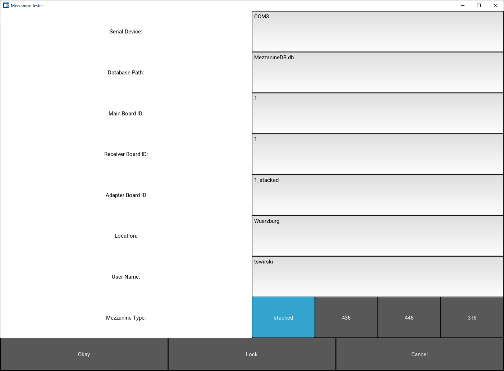
    </a>
<p align="center">

The serial device (COMX on Windows or /dev/ttySX on Linux for device X) can be set here. Also, the path to the database file can be set. The database contains information regarding the hardware used to test the card. This information needs to be provided by entering it in the fields for main board ID, receiver board ID and adapter board ID. The Location provided will also be entered in to the database, as is the user. The last option concerns the mapping of injection channels to readout channels of the mezzanine. Especially for the delay test, this option needs to be set correctly.

All options are locked when the screen is opened to avoid any accidental change of options. The can be unlocked by pressing the unlock button at the bottom center. Pressing cancel reverts all changes made, while pressing okay changes them. All these options are inside the configuration file and will be loaded automatically on startup.

### Mezzanine Configuration

The Mezzanine configuration can be used by experts to set all options for the mezzanine cards. This includes voltage supply options, the ASD configurations and the JTAG settings. A picture of the screen can be seen here:

<p align="center">
    <a href="https://gitlab.cern.ch/tswirski/mezzanine-tester">
        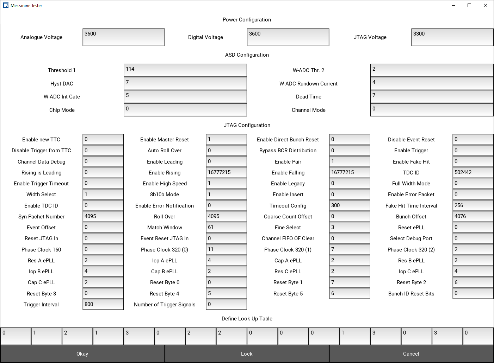
    </a>
<p align="center">

This section will not go into the meaning of each option. Please refer to the corresponding manuals (TDC or ASD) to check for their meaning. The options are locked when the screen is first opened. Pressing the unlock button at the bottom makes the options editable. Some settings, e.g. the ASD Threshold 1, will be changed by tests and will be set to the old value afterwards. Changing the settings here will not change to what they are set during that test.

A click on okay will save the changes, while a press on cancel will discard the changes. If you close the program, all values will be back to the default values on restart. If you change the type of card in the config menu, the ASD Threshold 1 and the voltages will automatically changed to the defaults for that card type.

### Test Setup

The test setup screen allows the user to choose which tests to run and to choose certain options for certain tests. A screenshot can be seen here:

<p align="center">
    <a href="https://gitlab.cern.ch/tswirski/mezzanine-tester">
        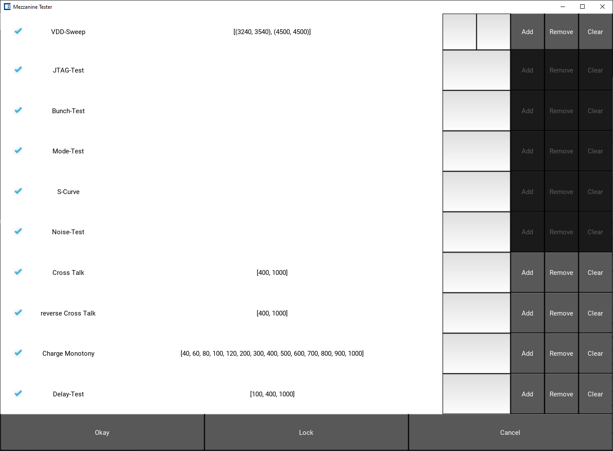
    </a>
<p align="center">

To the left of each test, a checkbox can be ticked on and off to enable or disable the corresponding test. For the VDD-Sweep test, the input voltages that are to be tested can be set. For cross talk, reverse cross talk, charge monotony and delay test, the charges at which to run the test can be set. This can be done by entering a voltage pair or charge, clicking add (or remove to remove this voltage). The charges can also be cleared by pressing the clear button.

As with the other settings screens, all options are locked and can be unlocked by the unlock button in the center of the screen. Again, pressing okay saves the changes, while cancel discards them. As with the mezzanine config, whenever the program is started, the default test regime will be loaded.

### Result Screens

Each test has its own result screen. In addition, clicking the Initialization "test" will open a test overview. All these screens will be explained in the following sections.

#### Test Overview

Hitting the Initialization button on the main screen once a test has been run will show an overview of the results.

<p align="center">
    <a href="https://gitlab.cern.ch/tswirski/mezzanine-tester">
        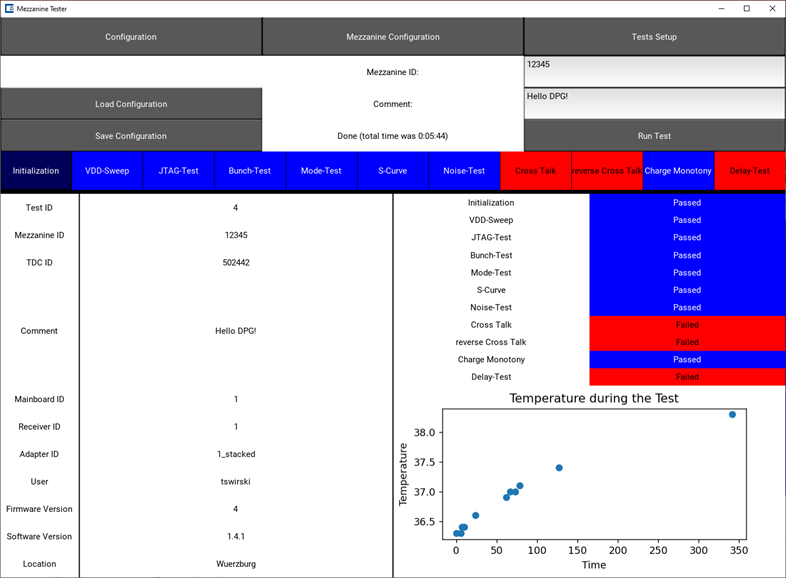
    </a>
<p align="center">

It shows the metadata of the test, like test number, comments, mezzanine-id and the user who performed the test on the left side. On the right side, the flags for each test will be displayed. In addition, on the bottom right, a temeprature plot can be seen. The plot will be replaced by the temperature before and after the test if viewed inside the database tool.

#### VDD-Test Result

The VDD-Test is designed to check the power supply of the mezzanine card and measure the currents for different input voltages. In addition, it measures the temperature of the card. Clicking a set of input voltages will show the corresponding measured values.

#### JTAG-Test Result

During the JTAG-Test, the communication to the chip for configuration purposes is tested, including the instruction register. A flag is shown for every part of the test.

#### Bunch-Test Result

During the Bunch-Test, the triggered read-out mode is tested for the correct numbering of bunches and events as well as a correct rate for the recorded events. A flag is shown for every event that was expected during the test.

#### Mode-Test Result

During the mode-test, all different variations of read-out modes are tested one-by-one for correct behaviour and rate. For each mode, a flag ist returned and shown in the test results. 

#### S-Curve Result

<p align="center">
    <a href="https://gitlab.cern.ch/tswirski/mezzanine-tester">
        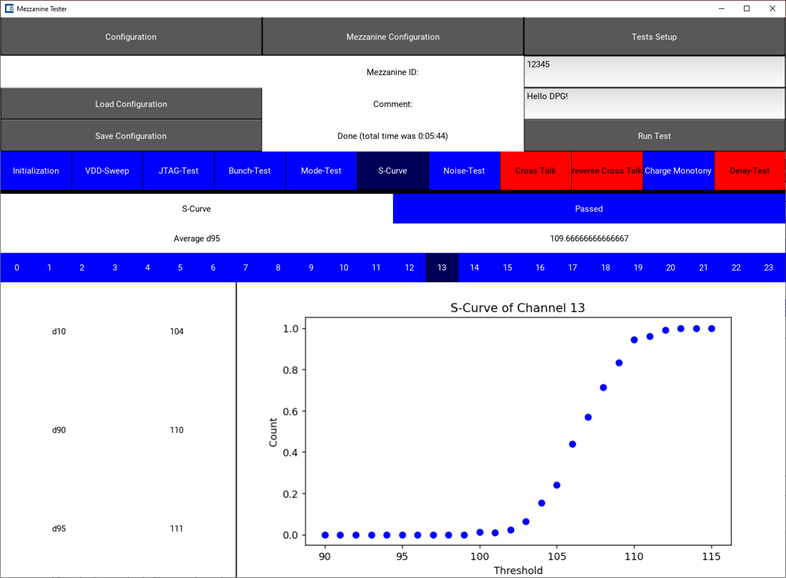
    </a>
<p align="center">

During the S-Curve test, a set charge is repeatedly injected into all channels. Between the trains of injections, the ASD Threshold setting is changed. The ration of detected hits is recorded for every ASD Threshold and then plotted for every channel. In addition, the threshold at which 10%, 90%, and 95% of all hits are recorded are noted. The average of the 95%-value for all channels is also shown. Clicking on a channel number shows the corresponding values

#### Noise-Test Result

The Noise-Test records the hits in all channels while there is no charge being injected. For each channel, the noise is recorded and shown in the result screen.

#### Cross Talk Result

<p align="center">
    <a href="https://gitlab.cern.ch/tswirski/mezzanine-tester">
        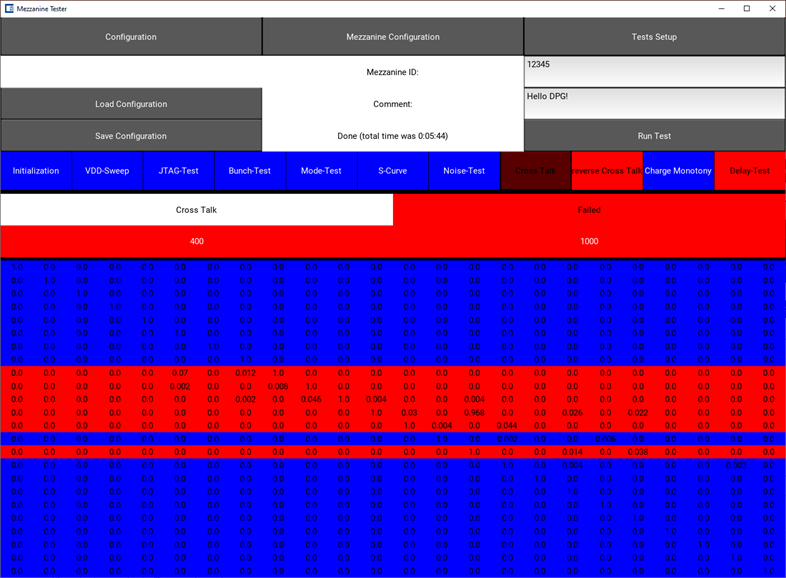
    </a>
<p align="center">

The Cross Talk Test injects a predefined charge into each channel one by one and records the hits registered in all channels. It records the full 24x24 matrix which should be diagonal for a normally working mezzanine card. rows (injected channels) that are not as to be expected will be marked red. A click on a charge will show the corresponding crosstalk matrix.

#### Reverse Cross Talk Result

<p align="center">
    <a href="https://gitlab.cern.ch/tswirski/mezzanine-tester">
        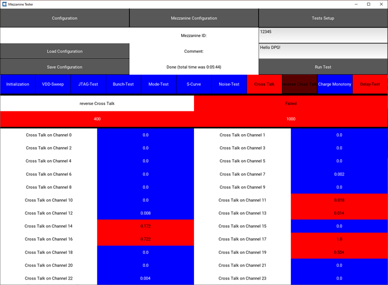
    </a>
<p align="center">

In the reverse Cross Talk Test, every channel exept one will be injected with a predefined charge and the response in the empty channel is recorded. Ideally, it should show no hits. A click on a charge will show the corresponding hit rates for each channel.

#### Charge Monotony Test Result

<p align="center">
    <a href="https://gitlab.cern.ch/tswirski/mezzanine-tester">
        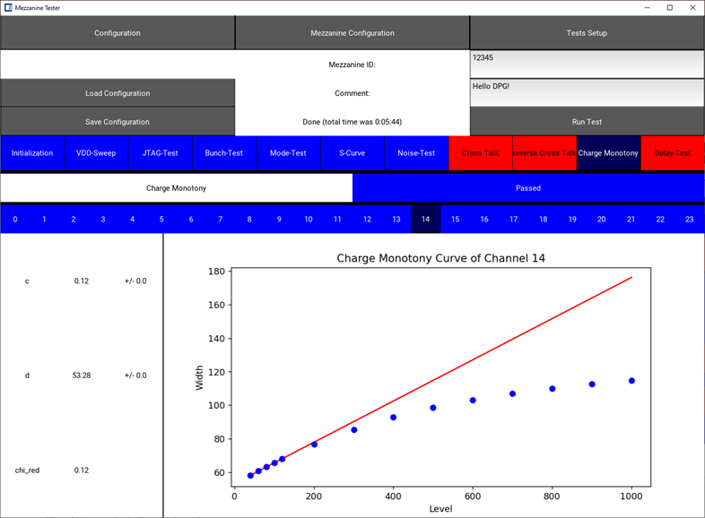
    </a>
<p align="center">

The Charge Monotony Test checks the relation between the input charge and the measurement output. This should be linear for low charges and for larger charges monotonous (i.e. a higher input should generate a higher output). For every channel the result, including the result of the linear fit in the low-charge region can be seen by clicking the corresponding button.

#### Delay-Test Result

<p align="center">
    <a href="https://gitlab.cern.ch/tswirski/mezzanine-tester">
        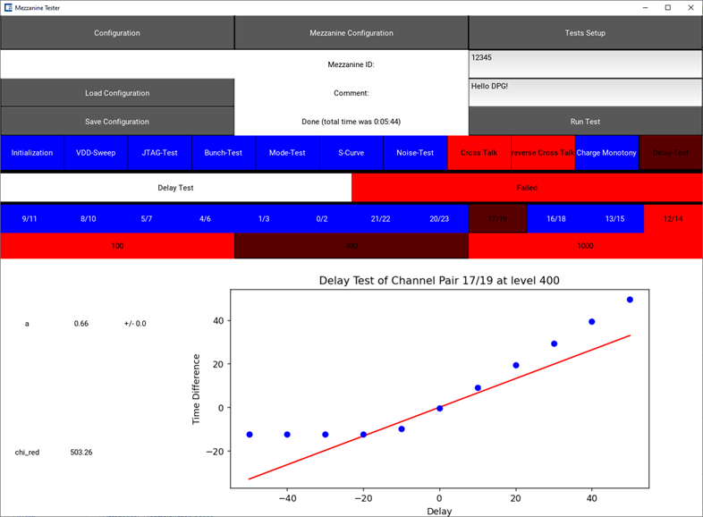
    </a>
<p align="center">

The Tester Tool Hardware has two banks of charge injectors that can be delayed with respect to each other. Due to signal travel, not all channels of a bank are injected at the same time, but they are delayed by ~60ps one after the other. This creates pairs of channels that should exhibit the delay that is set. Which channels are paired up depends on the mezzanine type, which is why it must be set correctly in the Configuration.

There are 11 delay options, from -50ns to 50ns in steps of 10ns. Each measurement is performed and the difference between channel pairs is recorded. Then, a linear function is fitted to the plot. This is done for a defined set of charges. Clicking on a charge and then clicking on a channel pair will show the corresponding result.

## The Database Tool

The Database Tool is used to read a performed test from the database after the fact to get information on failure modes, especially for experts. It can also be used to export plots made during the test into files.

### List of Tests

<p align="center">
    <a href="https://gitlab.cern.ch/tswirski/mezzanine-tester">
        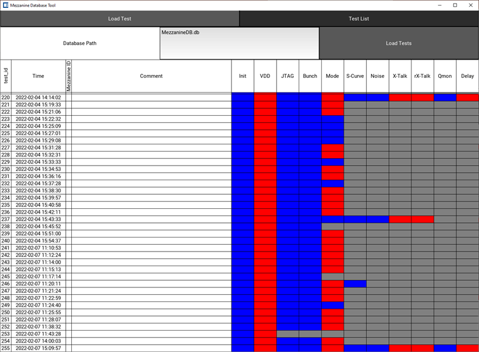
    </a>
<p align="center">

When the program is started, the list will be empty. By entering the path (relative or absolute) and then clicking the 'Load Tests' button, the database will be loaded and all tests that have been performed will appear in the list, including flags for all tests. Clicking on a test opens the [test view](#test-view).

### Test View

Clicking a test in the [List of Tests](#list-of-tests) will open the screen with test results as it can be seen in the Tester Software. Some information is not stored in the data base and is therefore left blank. Otherwise, the layout of the screens is the same as during the testing. Clicking the 'Print Plots' button will write all plots in the provided folder into a new folder named after the test number.

<p align="center">
    <a href="https://gitlab.cern.ch/tswirski/mezzanine-tester">
        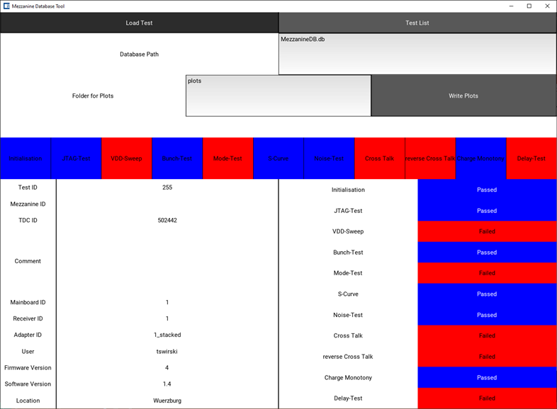
    </a>
<p align="center">

# Using the Program
Most of the settings for the test are already set up when the program is first started. If a configuration file exists, it will be automatically loaded on program start. First, check in the [Configurations](#configuration) whether the correct serial device and database file are set and enter the info about the hardware used and the location and user. Also make sure the right card geometry is selected.

Once the basic settings are correct, the only thing that remains is setting the mezzanine ID in the corresponding field of the [Main Screen](#the-main-screen), and add a comment if there is something particular about the test. Then click 'Run Test'.

After the first startup, the software will validate the Tester Tool Hardware. The test will start immediately once this test is successful. The progress of the test can be seen in the field next to the 'Run Test' button. In addition, which test is being performed is seen in the ribbon below. Tests that have been completed show as either blue for passed or red for failed. Yellow indicates the current test. Gray tests are queued and black indicates an aborted test.

Once the test is done, the next test can be performed immediately. Everything is automatically entered into the database, no saving is necessary. If the test is aborted by clicking the 'Abort Test' button, the programm will still finish the current (yellow) test, and will then stop the tests that have still been scheduled.

Once all tests are performed for the session, the program can simply be closed by using the right top X.